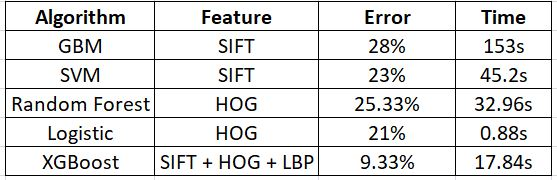

# Project: Dogs, Fried Chicken or Blueberry Muffins?


+ Team members
	+ Cui, Wanting
	+ Ding, Xueying
	+ Ji, Hanying
	+ Tong, Yu
	+ Wen, Lan

+ Project summary: In this project, we created a classification engine for images of dogs versus fried chicken versus blueberry muffins. 
	+ The aim of this project is to improve the baseline model of image classification, which uses SIFT features and gradient boosting machine (GBM) classifier, by exploring and evaluating other image feature extraction and classification methods.
	+ In the feature extraction stage, we tried SIFT, GIST, RootSIFT, HOG and LBP feature extraction methods.
	+ In the model selection stage, we compared and evaluated GBM, non-linear SVM, Random Forest, XGBoost, Logistic regression and CNN (Convolutional Neural Network) methods.

+ Following are the results:
	+ Baseline model: GBM model with SIFT features. Test Error: 28%, model processing time: 153s.
	+ Advanced model: XGBoost model with SIFT + HOG + LBP features. Test Error: 9.33%, model processing time: 17.84s.
	+ Here is the comparison between different models: 
	
	

+ Possible Improvements: 
  By using the combination of SIFT, HOG and LBP as feature detector and XGBoost as the classify algorithm, we can improve our model by reducing the test error from 28% to 9.3%.

**Contribution statement**: ([default](doc/a_note_on_contributions.md)) All team members contributed equally in all stages of this project. All team members approve our work presented in this GitHub repository including this contributions statement.
+ Cui, Wanting: Conduct GIST feature extraction, train/test XGBoost Model, write main.rmd
+ Ding, Xueying: Conduct LBP feature extraction, train/test Logistic Model
+ Ji, Hanying: Conduct HOG feature extraction, train/test Random Forest Model
+ Tong, Yu: Train/test GBM and CNN Model, prepare presentation and presentor
+ Wen, Lan: Conduct RootSIFT feature extraction, train/test RBF SVM Model

Following [suggestions](http://nicercode.github.io/blog/2013-04-05-projects/) by [RICH FITZJOHN](http://nicercode.github.io/about/#Team) (@richfitz). This folder is orgarnized as follows.

```
proj/
├── lib/
├── data/
├── doc/
├── figs/
└── output/
```

Please see each subfolder for a README file.
